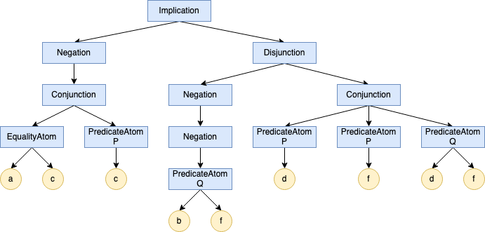

Cvičenie 2
==========

Riešenie tohto cvičenia (úloha [Formula](#formula-2b)) odovzdávajte
podľa [pokynov na konci tohoto zadania](#technické-detaily-riešenia)
do **stredy 11.3. 23:59:59**.

Či ste správne vytvorili pull request si môžete overiť
v [tomto zozname PR pre pu03](https://github.com/pulls?utf8=%E2%9C%93&q=is%3Aopen+is%3Apr+user%3AFMFI-UK-1-AIN-412+base%3Apu03).

Všetky ukážkové a testovacie súbory k tomuto cvičeniu si môžete stiahnuť
ako jeden zip súbor
[pu03.zip](https://github.com/FMFI-UK-1-AIN-412/lpi/archive/pu03.zip).

## Formula (2b)

Vytvorte objektovú hierarchiu na reprezentáciu formúl výrokovologickej časti
logiky prvého rádu. Zadefinujte základné triedy `Constant` a `Formula`
a 7 tried odvodených od triedy `Formula` určených na reprezentáciu
jednotlivých druhov atomických a zložených formúl.

Všetky triedy naprogramujte ako knižnicu podľa
[pokynov na konci tohoto zadania](#technické-detaily-riešenia).

```
Structure
    domain -> Set of String              // mnozina prvkov v domene
    iC -> Map<String, String>            // interpretacia symbolov konstant
    iP -> Map<String, Set<List<String>>> // interpretacia predikatovych symbolov

Constant
    constructor(String name)
    name() -> String
    eval(Structure m) -> String // vrati hodnotu konstanty v strukture m
                                // (jeden z prvkov m.domain)
    Bool equals(other)          // vrati true ak je tato konstanta rovnaka
                                // ako other

Formula
 │    constructor()
 │    Array of Formula subfs()      // vrati vsetky priame podformuly ako pole
 │    String toString()             // vrati retazcovu reprezentaciu formuly
 │    Bool isTrue(Structure m)      // vrati true, ak je formula pravdiva
 │                                  // v strukture m
 │    Bool equals(other)            // vrati true ak je tato formula rovnaka
 │                                  // ako other
 │    Int deg()                     // vrati stupen formuly
 │    atoms() -> Set of AtomicFormula // vrati mnozinu atomov
 │    constants() -> Set of String  // vrati mnozinu symbolov konstant
 │    predicates() -> Set of String // vrati mnozinu symbolov predikatov
 │
 ├─ AtomicFormula
 │   │
 │   ├─ PredicateAtom
 │   │      constructor(String name, Array of Constant args)
 │   │      name() -> String                 // vrati meno predikatu
 │   │      arguments() -> Array of Constant // vrati pole argumentov predikatu
 │   │
 │   └─ EqualityAtom
 │          constructor(Constant left, Constant right)
 │          left() -> Constant
 │          right() -> Constant
 │
 ├─ Negation
 │      constructor(Formula originalFormula)
 │      Formula originalFormula()   // vrati povodnu formulu
 │                                  // (jedinu priamu podformulu)
 │
 ├─ Disjunction
 │       constructor(Array of Formula disjuncts)
 │
 ├─ Conjunction
 │       constructor(Array of Formula conjuncts)
 │
 └─ BinaryFormula
      │   constructor(Formula leftSide, Formula rightSide)
      │   Formula leftSide()    // vrati lavu priamu podformulu
      │   Formula rightSide()   // vrati pravu priamu podformulu
      │
      ├─ Implication
      │
      └─ Equivalence
```
Samozrejme použite syntax a základné typy jazyka, ktorý používate (viď
príklady použitia knižnice na konci).

Metódy `toString`, `isSatisfied`, `equals`, `degree` a `substitute` budú
virtuálne metódy. Predefinujte ich v každej podtriede tak, aby robili *správnu
vec*<sup>TM</sup> pre dotyčný typ formuly.

_Poznámka:_ V závislosti od detailov vašej implementácieje je možné, že niektoré
z nich by mali rovnakú imlementáciu vo všetkých podtriedach. Vtedy je samozrejme
v poriadku (priam lepšie) implementovať ich raz v základnej triede.

Metóda `toString` vráti reťazcovú reprezentáciu formuly podľa nasledovných
pravidiel:
- `Constant`: reťazec `a`, kde `a` je meno konštanty (môže byť
  viacpísmenkové);
- `PredicateAtom`: reťazec `predName(C1,C2,C3...)`, kde `predName` je meno predikátu;
  a `C1`, `C2`, `C3`, ... sú reprezentácie argumentov (konštánt) predikátu
  (predikát s nula argumentami ma reprezentáciu `predName()`);
- `EqualityAtom`: reťazec `C1=C2`, kde `C1` a `C2` sú reprezentácie argumentov
  (konštánt) rovnostného atómu;
- `Negation`: reťazec `-A`, kde `A` je reprezentácia priamej podformuly
- `Conjunction`: reťazec `(A&B&C....)`, kde `A`, `B`, `C`, ... sú
  reprezentácie priamych podformúl (konjunktov);
- `Disjunction`:  reťazec `(A|B|C....)`, kde `A`, `B`, `C`, ... sú
  reprezentácie priamych podformúl (disjunktov);
- `Implication`:  reťazec `(A->B)`, kde `A` a `B` sú reprezentácie
  ľavej a pravej priamej podformuly;
- `Equivalence`: reťazec `(A<->B)`, kde `A` a `B` sú reprezentácie
  ľavej a pravej priamej podformuly.

Teda napríklad v objektovej štruktúre



metóda `toString` koreňového objektu triedy `Implication` vráti reťazec
`(-(a=c&P(c))->(--Q(b,f)|(P(d)&P(f)&Q(d,f))))`.

Metóda `eval` vráti hodnotu konštanty v danej štruktúre, teda prvok domény
štruktúry označený touto konštantou. Ak sa stane, že štruktúra neobsahuje
interpretáciu tejto konštanty, tak môžete buď vygenerovať chybu / výnimku
alebo vrátiť ľubovoľnú hodnotu.

Metóda `isTrue` vráti `true` alebo `false` podľa toho, či je formula
pravdivá v danej štruktúre. Ak sa stane, že štruktúra neobsahuje
interpretáciu niektorého symbolu, ktorý sa vyskytne vo formule, tak môžete
buď vygenerovať chybu / výnimku alebo ju považovať za `false`.

Metóda `equals` vráti `true`, ak je formula alebo konštanta reprezentovaná
touto inštanciou rovnaká ako tá reprezentovaná inštanciou `other`. Táto
metóda je dôležitá, pretože zabudovaný operátor rovnosti vo väčšine jazykov
porovnáva či sa jedná o tú istú inštanciu objektu. Napríklad
`new Constant('a') == new Constant('a')` v Jave vráti `false`, pretože
porovnávame dve rôzne inštancie triedy `Constant`.

Metóda `deg` vráti stupeň formuly tak, ako bol zadefinovaný na prednáške.

Metóda `atoms` vráti množinu všetkých atómov vyskytujúcich sa v tejto formule.

Metóda `constants` vráti množinu všetkých _mien_ konštánt (teda reťazcov,
_nie_ objektov triedy `Constant`), ktoré sa vyskytujú vo formule. Podobne
`predicates` vráti množinu všetkých mien predikátov vyskytujúcich sa vo
formule.

### Java
Aby metóda `equals` fungovala tak, ako Java očakáva, argument `other` musí
mať typ `Object`.

## Štruktúra a ohodnotenie premenných

Štruktúra je objekt s nasledovnými atribútmi:

- `domain` - množina prvkov domény. Pre jednoduchosť sú prvkami domény
  reťazce. Použite vhodnú štruktúru jazyka, ktorý používate.
  Mala by umožňovať iterovať cez všetky prvky a testovať príslušnosť.
- `iC` - interpretácia symbolov konštánt. Mapa z mien konštánt na prvky z `domain`.
- `iP` - interpretácia predikátových symbolov. Mapa z mien predikátov na množinu
  zoznamov/`n`-tíc prvkov z `domain` (kde `n` je arita príslušného symbolu).

*Poznámka:* Štruktúra štruktúry (pun intended) je navrhnutá tak, aby čo
najviac zodpovedala teórii z prednášky (teda skoro, mala by to byť jedna
mapa spolu). Všimnite si, že pre predikát s aritou `n == 1` budú prvkami
`iP` pre tento predikát jednoprvkové zoznamy. V praxi môže byť praktickejšie
(again) použiť iné reprezentácie. Interpretácie predikátov môžu tiež byť
reprezentované ako funkcie (s návratovou hodnotou typu bool), čo môže byť
pamäťovo efektívnejšie.

### Java
Použite implementácie rozhraní `java.util.Set` a `java.util.Map` (napr. `java.util.HashMap`
na reprezentovanie ohodnotenia).

Príklad použitia pri vyhodnotení predikátového atómu:
```java
List<String> argVals = new ArrayList<>();
for (Constant arg: arguments()) {
  argVals.add(arg.eval(m));
}
return m.iP(name()).contains(argVals);
```

## Technické detaily riešenia

Riešenie [odovzdajte](../../docs/odovzdavanie.md) do vetvy `pu03` v podadresári
`prakticke/pu03` podľa jazyka.

Odovzdávanie riešení v iných jazykoch konzultujte s cvičiacimi.

Správne vytvorený pull request sa objaví
v [zozname PR pre `pu03`](https://github.com/pulls?utf8=%E2%9C%93&q=is%3Aopen+is%3Apr+user%3AFMFI-UK-1-AIN-412+base%3Apu03).

### Java
Odovzdajte súbor `Formula.java` v podadresári [java](java/).
Testovací program [`FormulaTest.java`](java/FormulaTest.java) musí byť skompilovateľný
a korektne zbehnúť, keď sa k nemu priloží vaša knižnica.
